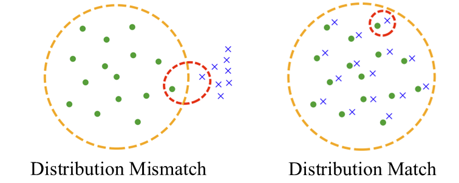
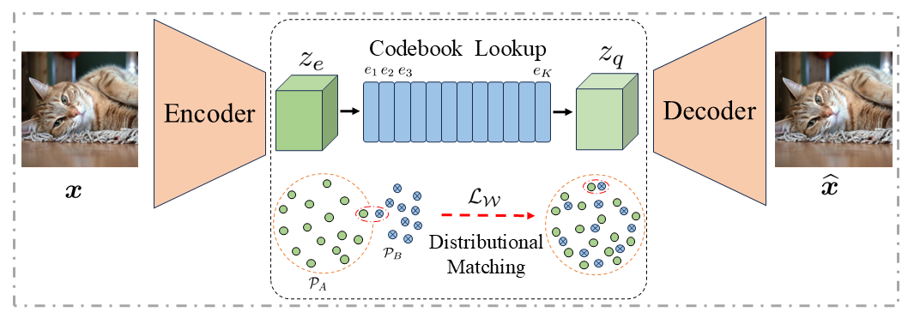
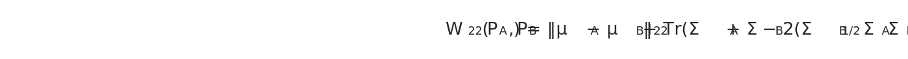
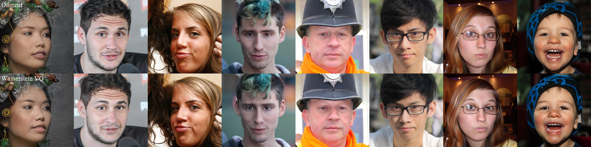
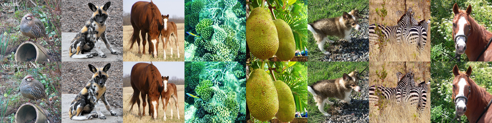
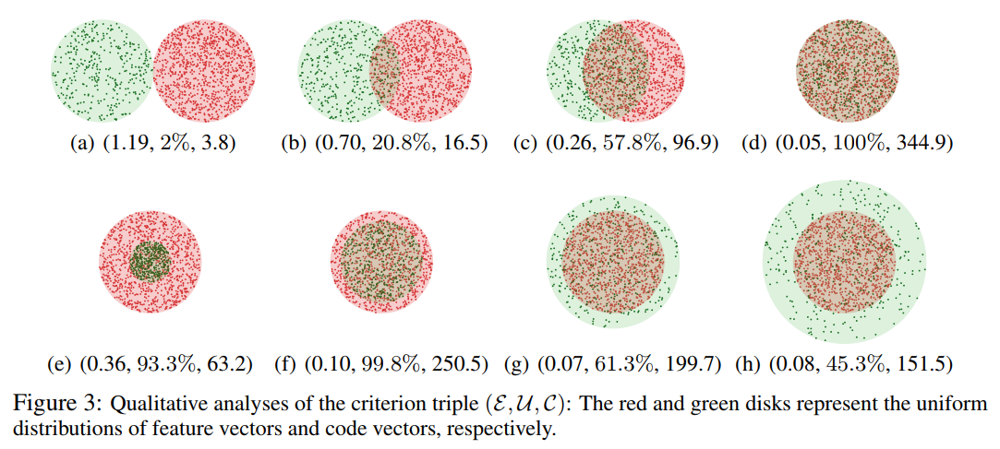
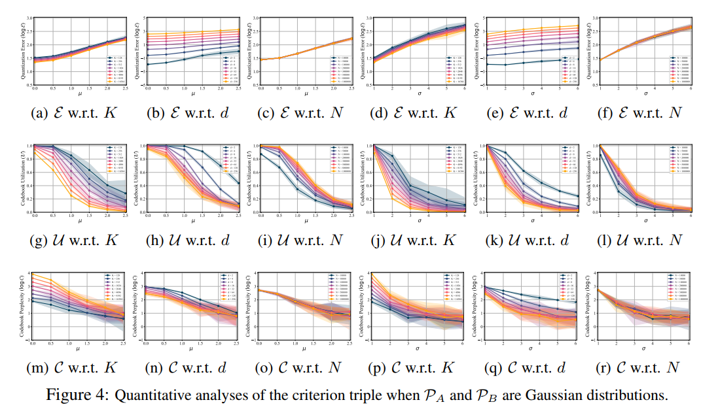
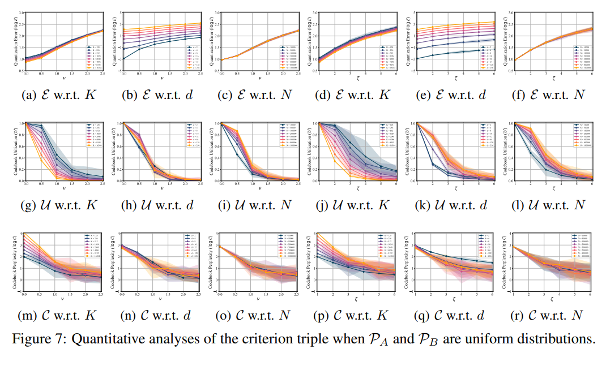
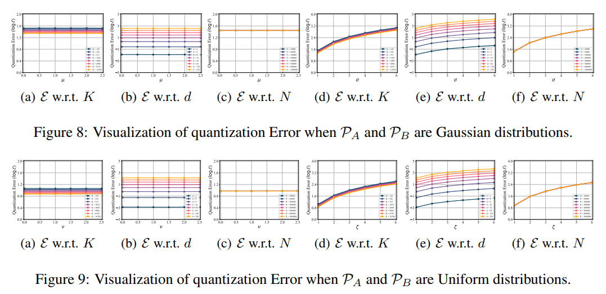

<div align="center">

# Distributional Matching for Vector Quantization

### A Unified Theoretical and Empirical Framework

[](https://vq-research.github.io/Wasserstein-VQ/)
[](https://vq-research.github.io/Wasserstein-VQ/assets/Distributional_Matching_Vector_Quantization.pdf)
[](https://huggingface.co/sunset-clouds/Wasserstein-VAR)

<strong><a href="https://sunset-clouds.github.io/">Xianghong Fang</a><sup>1*</sup></strong> · **Litao Guo<sup>2</sup>** · **Hengchao Chen<sup>1</sup>** · **Yuxuan Zhang<sup>1</sup>** · **Xiaofan Xia<sup>1</sup>** · **Dingjie Song<sup>4</sup>** · **Yexin Liu<sup>2</sup>** · **Hao Wang<sup>5</sup>** · **Harry Yang<sup>2</sup>** · **Qiang Sun<sup>1</sup>** · <strong>Yuan Yuan<sup>3*</sup></strong>

<sup>1</sup> University of Toronto · <sup>2</sup> HKUST · <sup>3</sup> Boston College · <sup>4</sup> Lehigh University · <sup>5</sup> SUSTech<br>
\* Corresponding authors

</div>

---

Vector quantization is often limited by two seemingly different failures: **training instability** and **codebook collapse**. We show that both arise from the same underlying issue—a mismatch between the distributions of encoder features and code vectors—and introduce a unified distributional-matching framework to address it.

Our practical instantiation, **Wasserstein VQ**, aligns the first- and second-order statistics of the two distributions through an efficient closed-form quadratic Wasserstein objective. A nonparametric MMD variant is also included. Across VQ-VAE, fixed-scale VQGAN, and multi-scale VAR, distribution matching improves codebook coverage, reconstruction quality, and scaling to very large codebooks.

<p align="center">
  
</p>

## Highlights

- **One explanation for two failures.** Distribution mismatch connects the STE gradient gap, quantization error, and codebook collapse.
- **A principled criterion triple.** We evaluate VQ through quantization error, codebook utilization, and codebook perplexity.
- **Theory meets practice.** In high-dimensional latent spaces, the asymptotically optimal code distribution approaches the feature distribution.
- **Large-codebook scaling.** Wasserstein VQ reaches approximately 100% utilization with codebooks as large as 100,000 on FFHQ and ImageNet-1K.
- **Architecture-agnostic.** The same objective applies to VQ-VAE, fixed-scale VQGAN, and multi-scale VAR tokenizers.
- **Reproducibility artifacts included.** Training scripts, logs, reconstruction metrics, r-FID/r-IS evaluation outputs, and simulation data are stored with the code.

## Method

<p align="center">
  
</p>

Let <i>P</i><sub>A</sub> denote the empirical feature distribution and <i>P</i><sub>B</sub> the code-vector distribution. We augment the local nearest-neighbor VQ objective with a global alignment term:

<p align="center">
  
</p>

Under a Gaussian approximation, the squared 2-Wasserstein distance has a closed form:

<p align="center">
  
</p>

The matching gradient updates the **codebook only**, leaving the encoder free to learn expressive features.

## Main results

### VQ-VAE with 100,000 codes

All models use 256 tokens. SSIM is reported on the paper's 0–100 scale.

| Dataset | Method | Utilization ↑ | Perplexity ↑ | PSNR ↑ | SSIM ↑ | Rec. loss ↓ |
|:--|:--|--:|--:|--:|--:|--:|
| FFHQ | Vanilla VQ | 0.6% | 481.0 | 27.86 | 74.2 | 0.0118 |
| FFHQ | EMA VQ | 2.7% | 2,087.5 | 28.43 | 74.8 | 0.0105 |
| FFHQ | Online VQ | 3.6% | 1,556.8 | 27.12 | 71.1 | 0.0142 |
| FFHQ | **Wasserstein VQ** | **100%** | **93,152.7** | **29.53** | **78.0** | **0.0083** |
| ImageNet-1K | Vanilla VQ | 0.4% | 337.0 | 24.43 | 57.4 | 0.0295 |
| ImageNet-1K | EMA VQ | 3.0% | 2,170.0 | 25.13 | 60.1 | 0.0257 |
| ImageNet-1K | Online VQ | 4.1% | 1,709.9 | 24.95 | 59.1 | 0.0267 |
| ImageNet-1K | **Wasserstein VQ** | **100%** | **93,264.7** | **25.88** | **63.0** | **0.0223** |

<p align="center">
  
</p>

### Fixed-scale VQGAN on ImageNet-1K

Decoder adaptation suffixes **a / b / c** correspond to **5 / 10 / 15 epochs**.

| Model | Tokens | Codebook | Utilization ↑ | r-FID ↓ | r-IS ↑ | LPIPS ↓ | PSNR ↑ | SSIM ↑ |
|:--|--:|--:|--:|--:|--:|--:|--:|--:|
| Wasserstein VQ-a | 512 | 16,384 | 99.8% | 1.04 | 191.3 | 0.114 | 24.36 | 64.0 |
| Wasserstein VQ-b | 512 | 32,768 | 99.8% | 0.88 | 196.2 | 0.109 | 24.60 | 64.7 |
| **Wasserstein VQ-c** | 512 | 65,536 | 99.6% | **0.79** | 198.5 | **0.104** | 24.73 | 65.2 |

### Multi-scale Wasserstein VAR on ImageNet-1K

The published checkpoints use **680 multi-scale tokens** and **32-dimensional codes**. Quantization statistics remain fixed during decoder refinement; r-FID improves as the decoder adapts.

| Model / checkpoint | Codebook | Adaptation | Quant. error ↓ | Utilization ↑ | Perplexity ↑ | r-FID ↓ |
|:--|--:|--:|--:|--:|--:|--:|
| VAR baseline | 4,096 | — | 0.283 | 100% | 2,981.4 | 0.92 |
| Wasserstein VAR-a | 4,096 | 5 epochs | **0.255** | **100%** | **3,286.2** | 0.93 |
| Wasserstein VAR-c | 4,096 | 15 epochs | **0.255** | **100%** | **3,286.2** | **0.81** |
| Wasserstein VAR-a | 8,192 | 5 epochs | **0.240** | **100%** | **6,518.2** | 0.83 |
| **Wasserstein VAR-c** | **8,192** | **15 epochs** | **0.240** | **100%** | **6,518.2** | **0.73** |

> Checkpoints: [Wasserstein-VAR on Hugging Face](https://huggingface.co/sunset-clouds/Wasserstein-VAR). The repository contains the 4,096- and 8,192-code models after 15 epochs of decoder adaptation.

<p align="center">
  
</p>

## Repository map

```text
Wasserstein-VQ/
├── code/
│   ├── VQVAE/                    # VQ training without a GAN
│   ├── VQGAN/                    # fixed-scale VQ + GAN training
│   └── VAR/                      # multi-scale VQ transplanted into VAR
├── SimulationAnalyses/
│   ├── DistributionalMatchingPerspective/  # atomic criterion-triple study
│   ├── Prototypical Study/                  # effects of matching: centers/radii
│   ├── QuantitativeAnalyses/                # controlled quantitative sweeps
│   └── QuantizationErrorLowerBoundAnalyses/ # empirical lower-bound analyses
├── figures/                     # README figures archived independently of LaTeX
└── docs/                        # project page and paper PDF
```

Each implementation under `code/` follows the same artifact layout where applicable:

- `scripts/`: training, decoder-refinement, reconstruction, and r-FID commands;
- `records/` or `logs/`: captured training output for reproduction and diagnosis;
- `results/`: per-epoch PSNR, SSIM, LPIPS, reconstruction/quantization statistics, plus r-FID/r-IS outputs;
- `models/` or `model/`: Vanilla, EMA, Online, Wasserstein, and MMD quantizers.

## Setup

```bash
git clone https://github.com/VQ-Research/Wasserstein-VQ.git
cd Wasserstein-VQ
```

Create a Python environment with PyTorch and the dependencies imported by the selected code path (`VQVAE`, `VQGAN`, or `VAR`). Dataset and checkpoint roots in the released shell scripts reflect the authors' cluster; set the corresponding paths in each `config.py` (and the Slurm headers, if used) before running.

## Training and evaluation

The checked-in scripts are the source of truth for the full hyperparameters and distributed settings.

### VQ-VAE (without GAN)

```bash
cd code/VQVAE

# Examples: FFHQ and ImageNet-1K
bash scripts/FFHQ/train_wasserstein_quantizer_ffhq_p1.sh
bash scripts/ImageNet/train_wasserstein_quantizer_imagenet_p1.sh
```

Additional scripts sweep codebook sizes and compare Vanilla VQ, EMA VQ, Online VQ, and Wasserstein VQ. Evaluation CSVs are in `code/VQVAE/results/{FFHQ,ImageNet}/`.

### Fixed-scale VQGAN

```bash
cd code/VQGAN

# Stage 1: transplant the quantizer (5 epochs)
bash scripts/transplant/wasserstein_vq_transplant_imagenet_p1.sh

# Stage 2: refine the decoder/adversarial model
bash scripts/refinement/wasserstein_vq_refinement_imagenet_p1.sh

# Evaluate r-FID/r-IS from saved reconstructions
bash scripts/rFID/rFID_refinement_p1.sh
```

### Multi-scale VAR

```bash
cd code/VAR

# Stage 1: transplant Wasserstein VQ into VAR
bash scripts/transplant/wasserstein_var_transplant_p1.sh   # K = 4,096
bash scripts/transplant/wasserstein_var_transplant_p2.sh   # K = 8,192

# Stage 2: decoder refinement (10/15-epoch variants are provided)
bash scripts/refinement/wasserstein_var_refinement_p2.sh   # K = 4,096, 15 epochs
bash scripts/refinement/wasserstein_var_refinement_p4.sh   # K = 8,192, 15 epochs

# Reconstruction distribution metrics
bash scripts/rFID/rFID_refinement_p1.sh
bash scripts/rFID/rFID_refinement_p2.sh
```

## Simulation analyses

The simulations isolate VQ behavior from encoder/decoder training and directly test the criterion triple.

| Study | Question | Entry point / output |
|:--|:--|:--|
| [Atomic setting](SimulationAnalyses/DistributionalMatchingPerspective/) | How do common VQ methods respond as feature/code distributions move into or out of alignment? | Gaussian and uniform scripts; CSVs and metric plots |
| [Prototypical study](SimulationAnalyses/Prototypical%20Study/) | How do matched/mismatched centers and radii affect the three criteria? | `Prototypical_Study.py` |
| [Quantitative analyses](SimulationAnalyses/QuantitativeAnalyses/) | How do codebook size, feature dimension, and sample size change performance? | Gaussian/uniform sweep scripts |
| [Lower-bound analyses](SimulationAnalyses/QuantizationErrorLowerBoundAnalyses/) | How closely does observed quantization error track the theoretical lower bound? | Gaussian/uniform sweep scripts |

<table>
  <tr>
    <td width="50%"></td>
    <td width="50%"></td>
  </tr>
  <tr>
    <td align="center"><b>Effects of distribution matching</b></td>
    <td align="center"><b>Controlled Gaussian analyses</b></td>
  </tr>
  <tr>
    <td width="50%"></td>
    <td width="50%"></td>
  </tr>
  <tr>
    <td align="center"><b>Controlled uniform analyses</b></td>
    <td align="center"><b>Quantization-error lower bounds</b></td>
  </tr>
</table>

## Citation

If this work is useful in your research, please cite:

```bibtex
@article{fang2026distributional,
  title   = {Distributional Matching for Vector Quantization:
             A Unified Theoretical and Empirical Framework},
  author  = {Fang, Xianghong and Guo, Litao and Chen, Hengchao and
             Zhang, Yuxuan and Xia, Xiaofan and Song, Dingjie and
             Liu, Yexin and Wang, Hao and Yang, Harry and Sun, Qiang and
             Yuan, Yuan},
  journal = {arXiv},
  year    = {2026}
}
```

## Acknowledgements

The VQGAN and VAR experiments build on the [VQ-Transplant](https://github.com/VQ-Research/VQ-Transplant) workflow. Please also cite the original VQ-VAE, VQGAN, VAR, and VQ-Transplant works when using the corresponding code paths.
