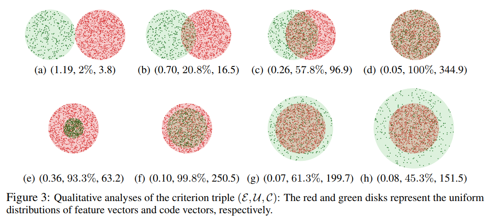

## Prototypical Study

### Get Started

Run the following code to conduct the Prototypical Study and visualize the results.
```bash
cd SimulationAnalyses/Prototypical Study
python Prototypical_Study.py
```


### Result

The plotted results will be saved in the current folder.


