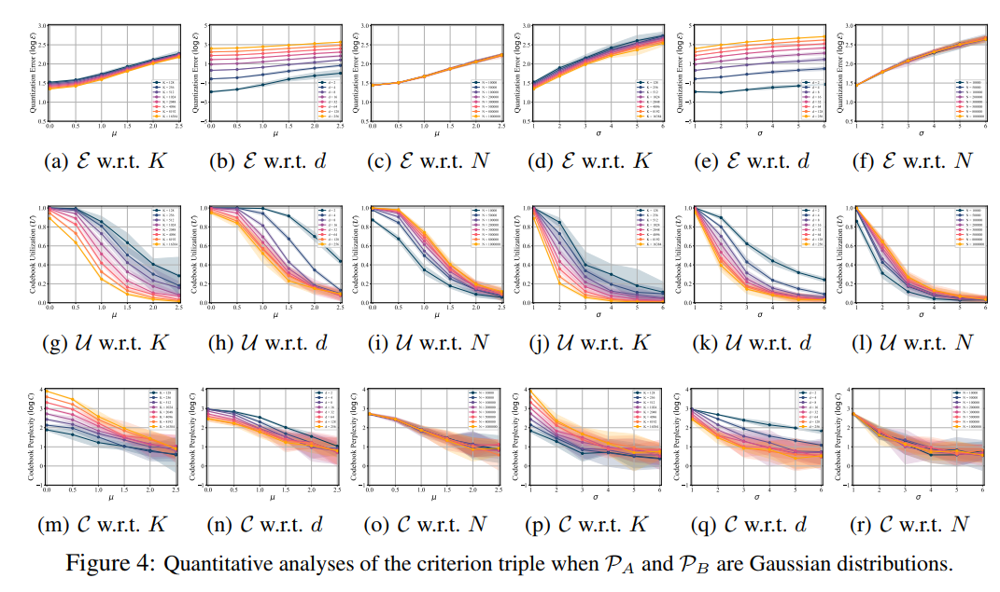
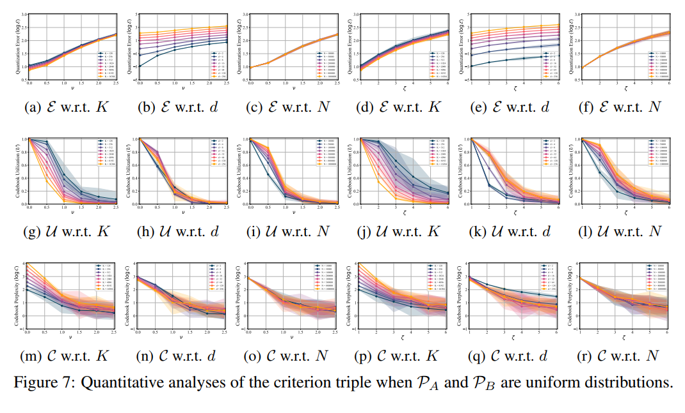

# VECTOR QUANTIZATION BY DISTRIBUTION MATCHING

## Quantitative Analyses

### Running Quantitative Analyses on Gaussian Distribution

Run the following code to conduct the Quantitative Analyses on Gaussian Distribution
```bash
cd SimulationAnalyses/QuantitativeAnalyses
python GaussianDistribution/AnalysisOnCodebookSize.py
python GaussianDistribution/AnalysisOnFeatureDim.py
python GaussianDistribution/AnalysisOnFeatureSize.py
```

### Result

The results will be stored in the folder as .pkl files. Run the following code to plot the results as line charts. The line charts will be saved in the `FIG` folder.

```bash
python GaussianDistribution/Plotting_Experienment_Gaussian_distribution.py
```



### Running Quantitative Analyses on Uniform Distribution

Run the following code to conduct the Quantitative Analyses on Uniform Distribution
```bash
cd SimulationAnalyses/QuantitativeAnalyses
python UniformDistribution/AnalysisOnCodebookSize.py
python UniformDistribution/AnalysisOnFeatureDim.py
python UniformDistribution/AnalysisOnFeatureSize.py
```

### Result

The results will be stored in the folder as .pkl files. Run the following code to plot the results as line charts. The line charts will be saved in the `FIG` folder.

```bash
python UniformDistribution/Plotting_Experienment_Uniform_distribution.py
```


