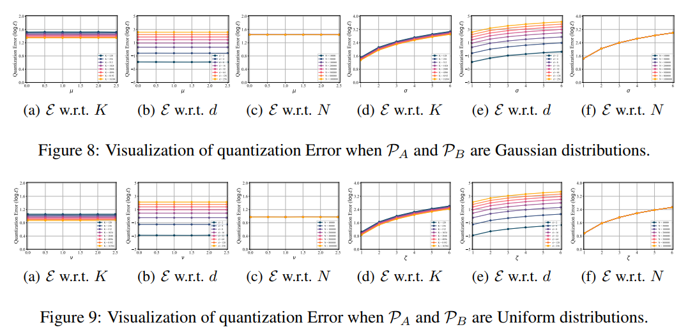

# VECTOR QUANTIZATION BY DISTRIBUTION MATCHING

## Quantization Error on LowerBound Analyses

Run the following code to conduct the LowerBound Analyses on Gaussian and Uniform Distribution
```bash
cd SimulationAnalyses/QuantizationErrorLowerBoundAnalyses

python GaussianDistribution/AnalysisOnCodebookSize.py
python GaussianDistribution/AnalysisOnFeatureDim.py
python GaussianDistribution/AnalysisOnFeatureSize.py

python UniformDistribution/AnalysisOnCodebookSize.py
python UniformDistribution/AnalysisOnFeatureDim.py
python UniformDistribution/AnalysisOnFeatureSize.py
```

### Result

The results will be stored in the folder as .pkl files. Run the following code to plot the results as line charts. The line charts will be saved in the `FIG` folder.

```bash
python Plotting_Experienment_LowerBoundAnalyses.py
```


